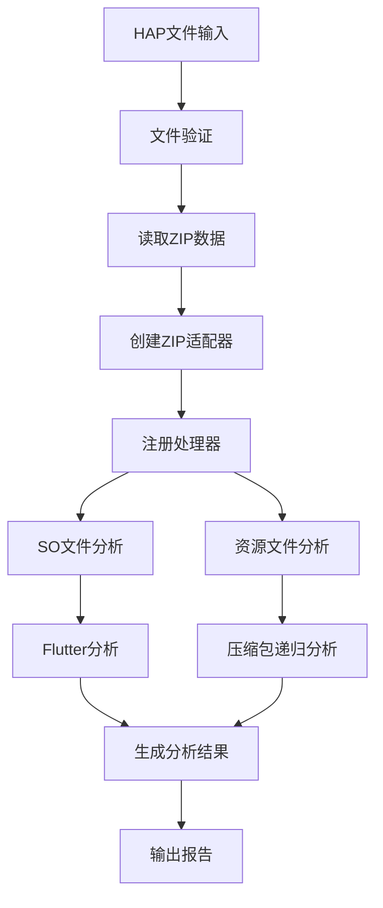

# HAP包分析逻辑与脚本说明

## 概述

ArkAnalyzer-HapRay 是一个用于分析鸿蒙应用包（HAP）的静态分析工具，能够深入分析HAP包中的SO文件、资源文件、Flutter应用等组件，并生成详细的分析报告。

## 整体架构

### 1. 核心分析服务

#### HapAnalysisService
- **位置**: `sa/src/services/analysis/hap_analysis.ts`
- **功能**: HAP分析的核心服务类，负责协调整个分析流程
- **主要方法**:
  - `analyzeHap()`: 分析HAP/ZIP文件的主入口
  - `analyzeZipData()`: 使用ZIP二进制数据进行分析
  - `registerBuiltInAnalyzers()`: 注册内置分析器

#### 分析流程


### 2. 文件处理器架构

#### HandlerRegistry
- **位置**: `sa/src/core/hap/registry.ts`
- **功能**: 文件处理器的注册和分发中心
- **支持的处理方式**:
  - 扩展名检测 (`ExtensionHandler`)
  - 魔术字节检测 (`MagicHandler`)
  - 文件夹检测 (`FolderHandler`)
  - 特定文件处理 (`FileHandler`)

#### 内置处理器
- **SoFileHandler**: 处理SO文件，进行框架识别和Flutter分析
- **GenericArchiveFileHandler**: 处理压缩包文件，支持递归解压
- **JsBundleFileHandler**: 处理JavaScript文件
- **HermesBytecodeFileHandler**: 处理Hermes字节码文件
- **DefaultResourceFileHandler**: 处理其他资源文件

### 3. 分析器组件

#### SO文件分析器 (SoAnalyzer)
- **位置**: `sa/src/core/hap/analyzers/so-analyzer.ts`
- **功能**: 
  - 识别SO文件中的框架类型
  - 检测系统库
  - 进行Flutter应用分析
- **支持的架构**: arm64-v8a, arm64
- **框架识别**: 基于文件名模式匹配

#### 资源文件分析器 (ResourceAnalyzer)
- **位置**: `sa/src/core/hap/analyzers/resource-analyzer.ts`
- **功能**:
  - 递归分析压缩包内容
  - 文件类型检测
  - 内存使用监控
- **特性**:
  - 支持最大5层递归深度
  - 内存使用限制保护
  - 文件大小限制

#### Flutter分析器 (FlutterAnalyzer)
- **位置**: `sa/src/core/hap/analyzers/flutter_analyzer.ts`
- **功能**:
  - 分析Dart包信息
  - 识别Flutter版本
  - 区分自研包和pub.dev包
- **分析流程**:
  1. 从SO文件中提取字符串
  2. 匹配package字符串模式
  3. 过滤pub.dev包，识别自研包
  4. 分析Flutter版本信息

### 4. 报告生成

#### HTML报告生成器
- **位置**: `sa/src/services/report/html-report.ts`
- **功能**: 生成交互式HTML分析报告
- **特性**:
  - 支持搜索和过滤
  - 递归压缩包展示
  - 框架统计图表
  - 响应式设计

## 配置文件更新脚本

### 脚本概述

`sa/scripts/` 目录下包含用于更新Flutter相关配置文件的脚本：

- `update_flutter_resources.js`: 主要的更新脚本
- `update_flutter_resources.bat`: Windows批处理文件
- `update_flutter_resources.sh`: Linux/Mac shell脚本

### 脚本功能

#### 1. 更新pub.dev包列表
```javascript
async function updatePubDevPackages() {
    // 从 https://pub.dev/api/package-name-completion-data 获取包列表
    // 保存到 sa/res/pub_dev_packages.json
}
```

**功能说明**:
- 从pub.dev官方API获取所有包名列表
- 用于Flutter分析时区分自研包和第三方包
- 更新频率: 建议定期更新以保持包列表的时效性

#### 2. 更新Flutter版本映射
```javascript
async function updateFlutterVersions() {
    // 从 https://flutter-ohos.obs.cn-south-1.myhuaweicloud.com/ 获取版本信息
    // 解析XML格式的版本映射
    // 保存到 sa/res/flutter_versions.json
}
```

**功能说明**:
- 从华为云OBS获取Flutter版本映射信息
- 解析XML格式的Contents块，提取40位Hex字符串和修改时间
- 用于Flutter版本识别和映射

### 使用方法

#### Windows系统
```batch
cd sa/scripts
update_flutter_resources.bat
```

#### Linux/Mac系统
```bash
cd sa/scripts
chmod +x update_flutter_resources.sh
./update_flutter_resources.sh
```

#### 直接运行Node.js脚本
```bash
cd sa/scripts
node update_flutter_resources.js
```

### 输出文件

脚本运行后会更新以下文件：

1. **sa/res/pub_dev_packages.json**
   ```json
   [
     "flutter",
     "material",
     "cupertino",
     ...
   ]
   ```

2. **sa/res/flutter_versions.json**
   ```json
   {
     "a1b2c3d4e5f6...": {
       "lastModified": "2024-01-01T00:00:00.000Z"
     },
     ...
   }
   ```

## 分析流程详解

### 1. HAP文件预处理

```typescript
// 文件验证
validateHapFile(hapFilePath);

// 读取文件数据
const fileData = await readHapFile(hapFilePath);

// 创建ZIP适配器
const zipAdapter = createEnhancedZipAdapter(fileData);
```

### 2. 文件分发处理

```typescript
// 遍历ZIP中的所有文件
for (const entry of zipAdapter.getEntries()) {
    // 根据文件类型分发到相应的处理器
    await registry.dispatchFile(entry.name, entry, zipAdapter, context);
}
```

### 3. SO文件分析流程

```typescript
// 1. 框架识别
const frameworks = identifyFrameworks(fileName);

// 2. 系统库检测
const isSystemLib = isSystemSo(fileName);

// 3. Flutter分析（如果是Flutter相关SO）
if (frameworks.includes('Flutter')) {
    const flutterResult = await flutterAnalyzer.analyzeFlutter(soPath);
}
```

### 4. 资源文件分析流程

```typescript
// 1. 文件类型检测
const fileType = detectFileType(fileName);

// 2. 压缩包递归分析
if (isArchiveFile(fileType)) {
    await analyzeZipRecursively(nestedZip, basePath, depth + 1, context);
}

// 3. 内存使用监控
const fileSize = await getFileSizeWithMemoryCheck(zipEntry, filePath);
```

### 5. Flutter分析流程

```typescript
// 1. 提取字符串
const strings = await elfAnalyzer.strings(soPath);

// 2. 匹配Dart包
const packageRegex = /package:([a-zA-Z0-9_]+)(?:@([0-9]+\.[0-9]+\.[0-9]+))?/g;

// 3. 过滤自研包
const customPackages = dartPackages.filter(pkg => !pubDevPackages.has(pkg.name));

// 4. 版本分析
const flutterVersion = await analyzeFlutterVersion(libflutterSoPath);
```

## 内存管理和错误处理

### 内存监控
- **MemoryMonitor**: 监控内存使用情况
- **文件大小限制**: 防止大文件导致内存溢出
- **流式处理**: 大文件采用流式读取

### 错误处理
- **ErrorFactory**: 统一的错误创建工厂
- **错误分类**: HAP文件错误、SO分析错误、资源分析错误
- **错误恢复**: 单个文件分析失败不影响整体流程

## 性能优化

### 1. 并发处理
- 支持多个HAP文件并发分析
- 文件内部处理采用异步模式

### 2. 内存优化
- 大文件流式处理
- 及时释放不需要的内存
- 内存使用监控和限制

### 3. 缓存机制
- Flutter版本映射缓存
- pub.dev包列表缓存
- 分析结果缓存

## 扩展性设计

### 1. 插件系统
```typescript
interface HapAnalyzerPlugin {
    name: string;
    analyze(zip: ZipInstance): Promise<HapAnalyzerPluginResult>;
}
```

### 2. 自定义处理器
```typescript
interface FileHandler {
    canHandle(filePath: string): boolean;
    handle(filePath: string, zipEntry: ZipEntry, zip: ZipInstance, context: FileProcessorContext): Promise<void>;
}
```

### 3. 报告格式扩展
- 支持多种输出格式（HTML、JSON、XML等）
- 可自定义报告模板
- 支持报告格式插件

## 使用示例

### 命令行使用
```bash
# 分析单个HAP文件
node sa/dist/cli/hap-analyzer.js analyze -i app.hap -o ./output -f html

# 分析目录中的所有HAP文件
node sa/dist/cli/hap-analyzer.js analyze -i ./hap-files -o ./output -f all
```

### 编程接口使用
```typescript
import { HapAnalysisService } from './sa/src/services/analysis/hap_analysis';

const analyzer = new HapAnalysisService({ verbose: true });
const result = await analyzer.analyzeHap('app.hap', './output');
console.log('分析完成:', result);
```

## 故障排除

### 常见问题

1. **内存不足**
   - 调整文件大小限制
   - 增加系统内存
   - 使用流式处理模式

2. **Flutter分析失败**
   - 检查Flutter版本映射文件是否最新
   - 更新pub.dev包列表
   - 检查SO文件完整性

3. **压缩包解压失败**
   - 检查压缩包格式
   - 调整递归深度限制
   - 检查文件权限

### 日志分析
- 启用verbose模式获取详细日志
- 检查错误堆栈信息
- 分析内存使用情况

## 总结

ArkAnalyzer-HapRay 提供了一个完整的HAP包分析解决方案，具有以下特点：

1. **全面的分析能力**: 支持SO文件、资源文件、Flutter应用等多种类型
2. **灵活的架构设计**: 基于处理器的可扩展架构
3. **强大的报告功能**: 交互式HTML报告，支持搜索和过滤
4. **完善的错误处理**: 统一的错误处理机制和恢复策略
5. **高效的性能**: 内存优化和并发处理支持
6. **易于维护**: 模块化设计，便于扩展和维护

通过定期更新配置文件脚本，可以保持分析工具的准确性和时效性，为鸿蒙应用开发提供有力的技术支持。
