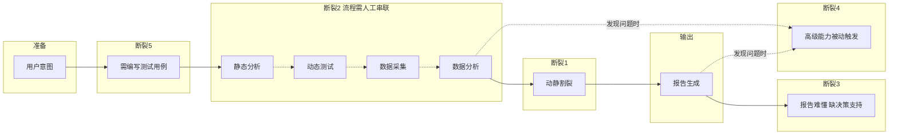
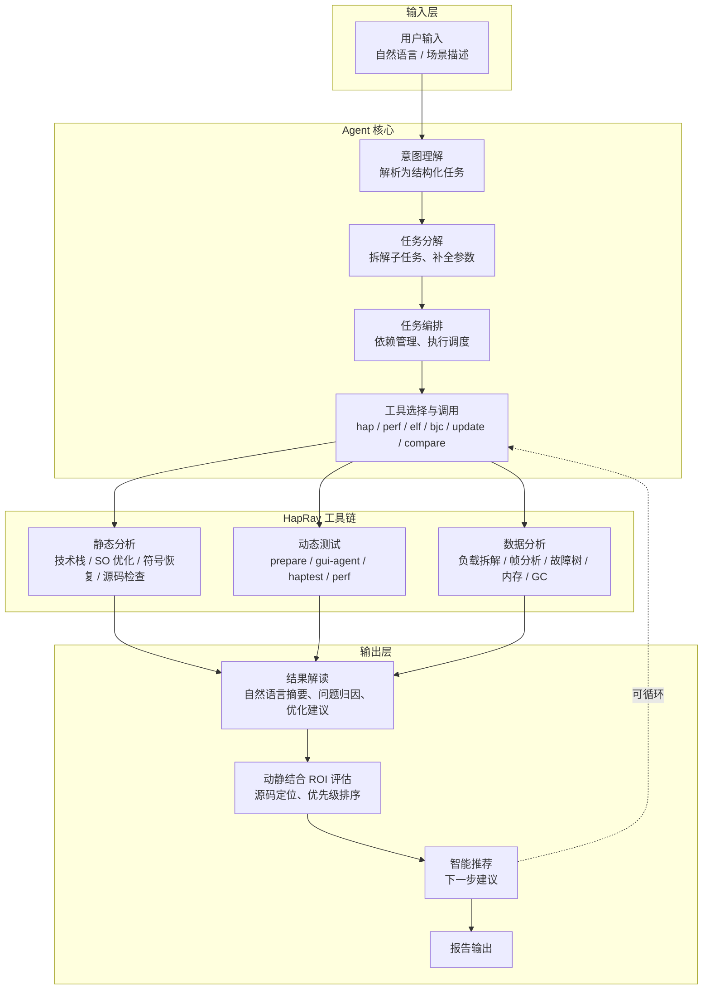
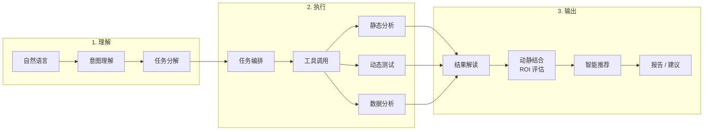
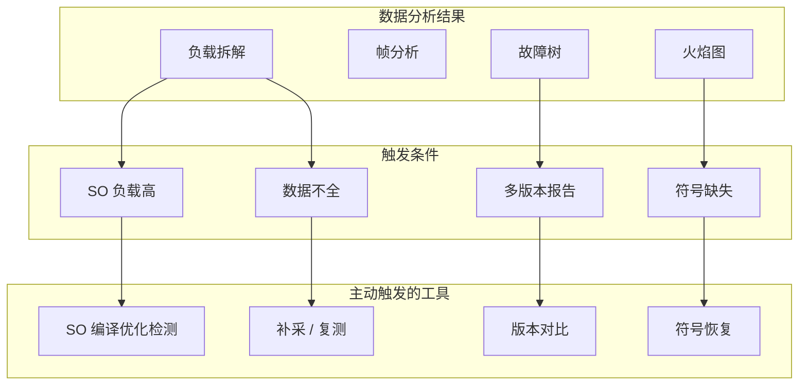

# 智能化负载分析 Agent 流程图

> 核心功能流程，用于设计与开发参考。

## HapRay 流程与 5 大断裂点

> 在 HapRay 现有流程中标注 5 个最需解决且能用大模型解决的问题，用断裂点表示流程中断位置。

**断裂点说明**

| 断裂点 | 问题 | 位置 |
|--------|------|------|
| ① | 动静割裂 | 数据分析 → 报告：动态数据与静态分析未打通，无法自动定位根因 |
| ② | 流程需人工串联 | 各步骤之间：静态→测试→分析→报告需人工编排（图中虚线表示） |
| ③ | 报告难懂、缺决策支持 | 报告 → 落地：难以解读、缺优先级与 ROI 排序 |
| ④ | 高级能力被动触发 | 分析/报告后：SO 优化、符号恢复等未按分析需要自动触发 |
| ⑤ | 动态测试需编写测试用例 | 准备 → 执行：需手写或录制用例，探索性场景成本高 |

---

## 五大断裂点需求表

| 断裂点 | 问题 | 问题说明 | 需求 | 需求描述 | 输入 | 输出 | 关联需求 |
|--------|------|----------|------|----------|------|------|----------|
| ① | 动静割裂 | 动态采集的 perf/trace/log 与静态分析未打通，空刷、高负载等发现后仍需人工做静态分析才能定位根因 | 动静结合诊断与优化建议 | **有源码**：将静态分析（ArkUI 反模式、源码检查、符号恢复）与动态分析结果关联，将热点/泄漏点映射到源码位置，生成可落地优化建议（含文件:行号、修改示例、预期收益）。**无源码**：结合符号恢复、SO 编译优化检测等逆向能力，将热点/泄漏点映射到 so:偏移，基于反汇编/反编译与 LLM 推断函数语义，生成可理解的诊断报告与优化建议（含 so:偏移、推断函数名/功能、瓶颈分析、编译优化空间评估） | 有源码：源码工程路径、场景报告、so 符号目录；无源码：场景报告、so 目录、HAP/二进制 | 关联诊断报告、高负载/内存问题清单（含源码或 so:偏移定位）、按优先级排序的优化建议 | 需求 53、53a |
| ② | 流程需人工串联 | 工具多、参数多，静态→测试→分析→报告等环节需人工编排，易漏步骤、易配错 | 任务编排与工具调用 | 支持多步骤任务的编排、依赖管理与执行调度，按依赖顺序串联静态分析→测试执行→数据分析→报告生成；根据意图和上下文自动选择并调用 HapRay CLI 工具，传递正确参数 | 任务 DAG 或任务列表、意图、上下文（当前目录、已有报告、设备状态） | 编排计划、执行状态、选中的工具及参数、调用结果 | 需求 49、50、51 |
| ③ | 报告难懂、缺决策支持 | 火焰图、故障树等报告需专业背景才能解读，缺少下一步建议和问题优先级/ROI 排序 | 结果解读与 ROI 评估 | 对分析结果进行语义解读，生成自然语言摘要、问题归因与优化建议；综合修复成本、预期收益、置信度等维度，输出按 ROI 排序的修复建议清单与量化评分 | 分析结果 JSON/DB、用户关注点、问题清单、负载/内存量化数据 | 自然语言报告、问题清单、ROI 评分、修复优先级排序、推荐修复顺序与理由 | 需求 52、54 |
| ④ | 高级能力被动触发 | SO 编译优化、符号恢复等依赖专家主动调用，未在分析到高 SO 负载、符号缺失时自动触发 | 智能推荐与主动触发 | 基于当前分析结果推理下一步操作，当检测到 SO 负载高时自动触发编译优化检测，当检测到符号缺失时自动触发符号恢复，并支持一键执行 | 分析结果、负载拆解/火焰图/故障树数据 | 推荐动作列表、理由说明、自动触发的工具及参数 | 需求 51、57 |
| ⑤ | 动态测试需编写测试用例 | 动态测试依赖预埋用例，需手写或录制测试脚本，探索性场景成本高 | 自然语言场景与 GUI Agent | 将用户的自然语言描述（如「测试首页冷启动」「探索应用主流程」）解析为可执行场景，驱动 GUI Agent 或 HapTest 在真机上执行，采集 perf/trace/内存数据并生成报告，无需预埋用例 | 自然语言场景描述、包名、LLM 配置 | 结构化场景定义、output/reports 步骤数据与报告 | 需求 14、16、48 |

---

## 主流程图

## 简化版（顶层视角）

## 工具调用决策（按分析需要主动触发）

