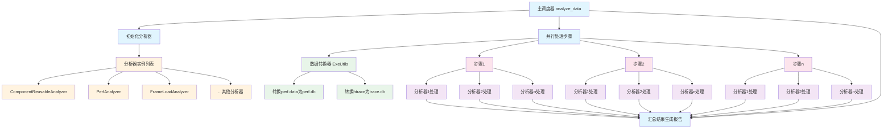
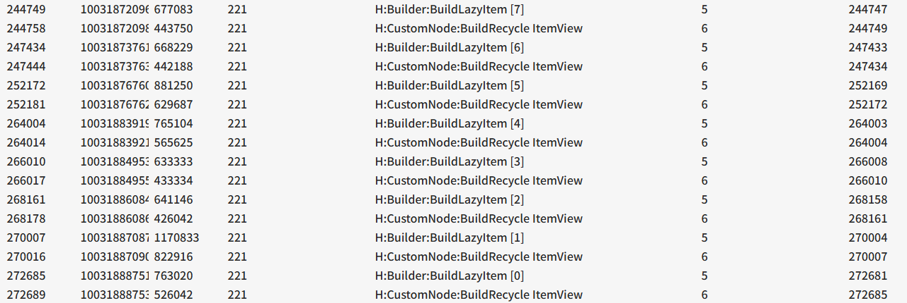
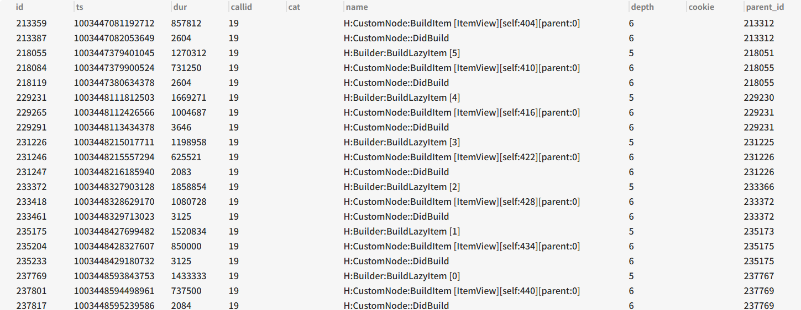

# 负载分析器模块设计

## 1. 模块概述

HapRay负载分析器模块是一个高性能、可扩展的自动化分析框架，专门设计用于处理大规模性能跟踪数据。该模块采用多分析器并行执行架构，能够对HiTrace和HiPerf采集的数据进行深度分析，生成全面的性能分析报告。

## 2. 架构设计

### 2.1 核心组件

#### 2.1.1 主调度器 (Main Dispatcher)
位于`__init__.py`中的`analyze_data`函数作为整个模块的入口点，负责协调整个分析流程：
- 初始化所有注册的分析器
- 并行处理多个步骤数据
- 汇总最终分析结果

#### 2.1.2 分析器基类 (BaseAnalyzer)
定义在`base_analyzer.py`中，提供所有分析器的统一接口：
- 抽象分析接口`_analyze_impl`
- 结果收集与报告生成机制
- 统一的错误处理框架

#### 2.1.3 具体分析器实现
如`ComponentReusableAnalyzer`等，每个分析器专注于特定性能指标的分析。

### 2.2 架构图


## 3. 核心特性

### 3.1 并行处理架构
- 使用`ThreadPoolExecutor`实现多步骤并行处理
- 支持可配置的最大工作线程数(MAX_WORKERS)
- 智能的任务分配和负载均衡

### 3.2 插件化分析器系统
- 通过`ANALYZER_CLASSES`配置注册分析器
- 自动化的分析器发现和初始化机制
- 支持分析器间的数据共享和依赖管理

### 3.3 性能监控与优化
- 详细的阶段耗时统计
- 分析器级性能分析
- 步骤处理时间排名和占比分析

## 4. 分析器接口规范

### 4.1 BaseAnalyzer抽象类

所有分析器必须继承BaseAnalyzer并实现以下方法：

```python
def _analyze_impl(self, step_dir: str, trace_db_path: str, perf_db_path: str, app_pids: list) -> Optional[dict[str, Any]]:
    """分析器核心实现逻辑"""
```

### 4.2 分析器注册机制

分析器通过以下方式注册到系统中：
1. 将分析器类名添加到`ANALYZER_CLASSES`列表
2. 实现对应的模块文件(使用蛇形命名法)
3. 模块需包含与分析器类同名的类定义

## 5. 数据分析流程

### 5.1 阶段一：初始化
- 加载所有配置的分析器
- 建立分析器实例
- 准备分析环境

### 5.2 阶段二：并行处理
- 遍历所有步骤目录
- 并行执行数据转换(htrace/perf转db)
- 并行执行各分析器的分析任务

### 5.3 阶段三：结果汇总
- 收集各分析器结果
- 生成统一格式的报告
- 输出JSON格式的分析结果

## 6. 分析器检测详细设计

### 6.1 组件复用特征分析
#### 6.1.1 组件复用背景
ArkUI组件复用是重要的性能优化机制，利用动态分析检测ArkUI组件中未复用的组件，挖掘应用性能优化机制，检测数据包括：
- 组件总构建次数
- 组件复用的次数
- 组件复用比率

#### 6.1.2 组件复用检测原理
**Trace特征**
组件复用时特征， H:Builder:BuildLazyItem → H:CustomNode:BuildRecycle ItemView


组件未复用时, H:Builder:BuildLazyItem → H:CustomNode:BuildItem [ItemView]


```sql
SELECT name FROM callstack WHERE name LIKE '%H:CustomNode:Build%'
```
**组件复用算法**

- SQL语句查询所有的name，存在复用/未复用两种Build，按照组件名[xx]统计总数/复用次数
`# H:CustomNode:BuildItem [ItemView][self:86][parent:-1]`
`# H:CustomNode:BuildRecycle ItemView`
- 组件名Build总数最大的组件作为最终结果展示
```json
{
    "max_component": "ItemView",
    "total_builds": 60,
    "recycled_builds": 58,
    "reusability_ratio": 0.97
  }
```
### 6.2 GC线程负载分析
#### 6.2.1 设计方案
1. **GC触发的次数合理**：应用进程触发GC的次数应合理，过多表示内存管理可能存在问题。统计trace中H:SharedGC、H:PartialGC、H:FullGC、H:SharedFullGC四类GC的次数。GC的次数和实际用例相关，暂无判断次数合理的方法。可以在两个版本间对比， 次数劣化<20%或 < 10次。
2. **GC线程负载占比合理**：在整个应用进程中的占比 >X% 时，表示GC线程负载占比过高，可能存在内存泄露。比较两个版本间GC线程劣化超过5%时，标记GC线程负载劣化过高。

#### 6.2.2 实现
**GC 触发次数查询**
```sql
  SELECT * FROM callstack 
WHERE 
(name LIKE '%H:FullGC::RunPhases%' 
	or name LIKE '%H:SharedFullGC::RunPhases%' 
	or name LIKE '%H:SharedGC::RunPhases%'
	 or name like '%H:PartialGC::RunPhases%')
and callid in ( 
	SELECT id FROM thread 
	where 
		ipid in (
			SELECT ipid FROM process  where pid = {pid}
			)
	)
```
**GC负载查询**
```sql
SELECT sum(event_count) 
FROM perf_sample 
where thread_id in
 (select thread_id 
	 from perf_thread 
	 where thread_name = 'OS_GC_Thread' 
	 and process_id in ({pid}))
```
### 6.3 冷启动冗余文件分析
1. 使能记录模块日志
```shell
hdc shell param set persist.ark.properties 0x200105c
hdc shell reboot
```
2. 冷启动应用，等待3s
3. 读应用data区生成的冗余文件
```shell
hdc file recv data/app/el2/100/base/${BUNDLE}/files/${BUNDLE}_redundant_file.txt
```
redundant_file.txt文件内容如下
```
unused file 916: &@hpaas/ez_kv_storage/src/main/ets/ts/Utils&33.5.1-alpha.1, cost time: 0.007ms
              parentModule 1: &@hpaas/ez_kv_storage/src/main/ets/kv/KevaStorage&33.5.1-alpha.1
unused file 917: &@hpem/hpem_npth_core/src/main/ets/com/bytedance/crash/game/GameErrorSummary&2.4.105, cost time: 0.021ms
              parentModule 1: &@hpem/hpem_npth_core/src/main/ets/com/bytedance/crash/async/AsyncLaunch&2.4.105
unused file 918: &@douyin/common_dto/src/main/ets/api/v1/aweme_v1_series_list&34.2.4, cost time: 0.063ms
              parentModule 1: &@douyin/common_dto/Index&34.2.4
unused file 919: &@hpaas/ez_router/src/main/ets/router/EzRoute&4.3.5, cost time: 0.095ms
              parentModule 1: &@hpaas/ez_router/src/main/ets/router/EzRouter&4.3.5
unused file 920: &@account/account_sdk/src/main/ets/monitor/AccountMonitorConstants&0.1.6, cost time: 0.121ms
              parentModule 1: &@account/account_sdk/src/main/ets/monitor/AccountMonitorUtils&0.1.6
unused file 921: @ohos:telephony.radio, cost time: 0.009ms
              parentModule 1: &@dp/applog/src/main/ets/utils/DeviceInfoUtils&1.3.4
```
解析redundant_file.txt分析冷启动未使用的冗余文件

## 7. 性能优化策略

### 7.1 数据缓存
- PID数据缓存避免重复读取
- 分析结果缓存机制
- 数据库连接复用

### 7.2 并行处理
- I/O密集型任务并行化
- CPU密集型任务线程池优化
- 资源竞争避免机制

### 7.3 懒加载机制
- 数据按需加载
- 分析器按需初始化
- 结果按需生成

## 8. 扩展性设计

### 8.1 分析器扩展
- 简单的分析器注册机制
- 统一的接口规范
- 自动化的依赖管理

### 8.2 数据处理扩展
- 支持新的数据源类型
- 可插拔的数据转换器
- 自定义数据处理管道

### 8.3 输出格式扩展
- 支持多种报告格式
- 可定制的输出结构
- 多维度结果聚合

## 9. 错误处理与容错

### 9.1 异常处理机制
- 分析器级异常隔离
- 步骤级错误容忍
- 全局异常捕获

### 9.2 重试机制
- 可配置的重试策略
- 失败步骤标记与跳过
- 错误结果记录与报告

## 10. 部署与使用

### 10.1 环境要求
- Python 3.7+
- SQLite3支持
- 足够的存储空间用于数据处理

### 10.2 配置说明
- 分析器列表配置
- 线程池大小调优
- 内存使用限制

## 11. 总结

HapRay负载自动化分析模块提供了一个高效、可扩展的性能分析框架，通过并行处理和插件化架构，能够快速处理大规模性能数据，生成深入的分析结果。该模块的设计注重性能、可扩展性和易用性，为性能优化工作提供了强有力的工具支持。
