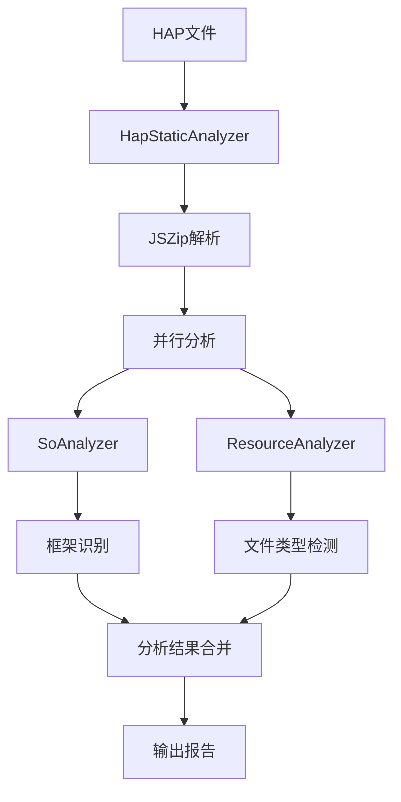

# HAP Static Analyzer

HAP Static Analyzer 是一个用于分析 HAP (HarmonyOS Application Package) 包的静态分析工具。它能够识别 HAP 包中使用的技术栈框架、分析 SO 文件和资源文件，为开发者提供详细的包结构信息。

## 🏗️ 架构概览

### 核心组件

```
staticanalyzer/
├── src/                          # 源代码目录
│   ├── analyzers/               # 分析器模块
│   │   ├── so-analyzer.ts       # SO文件分析器
│   │   └── resource-analyzer.ts # 资源文件分析器
│   ├── config/                  # 配置模块
│   │   ├── framework-patterns.ts # 框架模式配置
│   │   └── magic-numbers.ts     # 文件类型魔术字配置
│   ├── utils/                   # 工具模块
│   │   ├── file-utils.ts        # 文件操作工具
│   │   └── logger.ts            # 日志工具
│   ├── hap-static-analyzer.ts   # 主分析器
│   ├── cli.ts                   # 命令行接口
│   ├── index.ts                 # 库入口
│   └── types.ts                 # 类型定义
├── res/                         # 资源文件
│   ├── framework-patterns.json  # 框架识别模式
│   └── magic-numbers.json       # 文件类型识别配置
├── lib/                         # 编译输出目录
└── test/                        # 测试目录
```

### 数据流图



## 🔧 核心功能

### 1. SO文件分析
- **框架识别**: 基于SO文件名模式识别技术栈框架
- **支持的框架**: React Native, Flutter, Hermes, KMP, CMP, Lynx, Qt
- **系统库检测**: 识别系统级共享库
- **架构支持**: 主要支持 arm64-v8a 和 arm64 架构

### 2. 资源文件分析
- **文件类型检测**: 基于魔术字和扩展名识别文件类型
- **特殊文件处理**:
  - JavaScript文件（压缩检测）
  - Hermes字节码文件
  - 压缩文件（ZIP等）
- **统计信息**: 文件数量、大小、类型分布

### 3. 输出格式
- **JSON报告**: 结构化的分析结果
- **控制台输出**: 实时分析进度和摘要信息

## 📊 类型系统

### 主要接口

```typescript
// 分析结果主接口
interface HapStaticAnalysisResult {
    hapPath: string;
    soAnalysis: {
        detectedFrameworks: FrameworkType[];
        soFiles: SoAnalysisResult[];
        totalSoFiles: number;
    };
    resourceAnalysis: ResourceAnalysisResult;
    timestamp: Date;
}

// 框架类型枚举
enum FrameworkType {
    RN = 'RN',           // React Native
    Flutter = 'Flutter',
    Hermes = 'Hermes',
    KMP = 'KMP',         // Kotlin Multiplatform
    CMP = 'CMP',         // Compose Multiplatform
    Lynx = 'Lynx',
    Qt = 'Qt',
    System = 'System',
    Unknown = 'Unknown'
}
```

## 🚀 使用方式

### 命令行使用

```bash
# 基本分析
hapray-static -i app.hap -o ./output

# 详细输出
hapray-static -i app.hap -o ./output -v

# 指定输出格式
hapray-static -i app.hap -o ./output -f json
```

### 编程接口

```typescript
import { HapStaticAnalyzer, analyzeHap } from 'hapray-staticanalyzer';

// 方式1: 使用便捷函数
const result = await analyzeHap('path/to/app.hap', true);

// 方式2: 使用分析器类
const analyzer = new HapStaticAnalyzer(true);
const result = await analyzer.analyzeHap('path/to/app.hap');
```

## ⚙️ 配置系统

### 框架模式配置 (framework-patterns.json)

```json
{
  "frameworks": {
    "RN": {
      "name": "React Native",
      "patterns": [
        "libreact_.*.so",
        "librnoh.so",
        "librnoh_.*.so"
      ]
    }
  },
  "systemLibraries": [
    "libc.so",
    "libm.so"
  ]
}
```

### 文件类型配置 (magic-numbers.json)

```json
{
  "magicNumbers": [
    {
      "type": "ZIP",
      "signature": [80, 75],
      "offset": 0,
      "description": "ZIP archive"
    }
  ],
  "fileExtensions": {
    "js": "JS",
    "so": "SO"
  }
}
```

## 🔍 分析流程

### 1. HAP包解析
1. 验证HAP文件存在性
2. 使用JSZip加载HAP包
3. 遍历包内文件结构

### 2. 并行分析
- **SO分析器**: 扫描libs目录下的SO文件
- **资源分析器**: 分析所有非SO文件

### 3. 框架识别算法
```typescript
// 伪代码
for (const soFile of soFiles) {
    for (const [framework, patterns] of frameworkPatterns) {
        for (const pattern of patterns) {
            if (matchPattern(soFile.name, pattern)) {
                detectedFrameworks.add(framework);
            }
        }
    }
}
```

### 4. 结果聚合
- 合并SO分析和资源分析结果
- 生成统计信息
- 格式化输出

## 📈 性能特性

### 优化策略
- **内存优化**: 直接从ZIP流读取，避免完整解压
- **并行处理**: SO分析和资源分析并行执行
- **懒加载**: 配置文件按需加载

### 性能指标
- **小型HAP** (< 10MB): < 1秒
- **中型HAP** (10-50MB): 1-5秒
- **大型HAP** (> 50MB): 5-30秒

## 🛠️ 开发指南

### 构建项目

```bash
# 安装依赖
npm install

# 编译TypeScript
npm run build

# 运行测试
npm test

# 代码检查
npm run lint
```

### 添加新框架支持

1. 在 `framework-patterns.json` 中添加框架配置
2. 在 `FrameworkType` 枚举中添加新类型
3. 更新相关类型定义

### 添加新文件类型支持

1. 在 `magic-numbers.json` 中添加魔术字配置
2. 在 `FileType` 枚举中添加新类型
3. 更新检测逻辑

## 📝 输出示例

```json
{
  "metadata": {
    "hapPath": "/path/to/app.hap",
    "timestamp": "2025-09-22T08:30:51.454Z",
    "version": "1.0.0"
  },
  "soAnalysis": {
    "detectedFrameworks": ["RN", "Hermes"],
    "soFiles": [
      {
        "filePath": "libs/arm64-v8a/libreact_render_core.so",
        "fileName": "libreact_render_core.so",
        "frameworks": ["RN"],
        "fileSize": 2048576,
        "isSystemLib": false
      }
    ],
    "totalSoFiles": 5
  },
  "resourceAnalysis": {
    "totalFiles": 150,
    "totalSize": 10485760,
    "jsFiles": [
      {
        "filePath": "assets/js/bundle.js",
        "fileName": "bundle.js",
        "fileType": "JS",
        "fileSize": 1048576,
        "isMinified": true
      }
    ]
  }
}
```